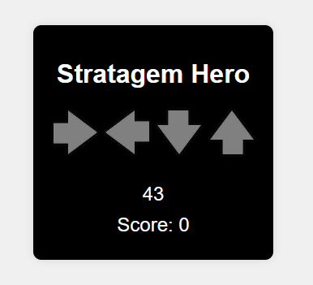

# Stratagem Hero

Stratagem Hero is a simple web-based game inspired by the stratagem mechanics from Helldivers II. Test your reflexes and memory as you input sequences of arrows to score points and beat the timer!



## Features

- Dynamic arrow sequences to challenge your memory and reflexes.
- Timer-based gameplay with rewards for completing sequences.
- Background music with a mute/unmute toggle.
- Simple and clean UI.

## Getting Started

Follow these steps to set up and run the project locally:

### Prerequisites

- [Node.js](https://nodejs.org/) (v16 or later recommended)
- [npm](https://www.npmjs.com/) (comes with Node.js)

### Installation

1. **Clone the repository:**
   ```bash
   git clone https://github.com/your-username/strategem-hero.git
   cd strategem-hero
   ```

2. **Install dependencies:**
   ```bash
   npm install
   ```

3. **Build the project:**
   ```bash
   npm run build
   ```

4. **Start the development server:**
   ```bash
   npm run start
   ```

5. **Open the game in your browser:**
   ```
   http://localhost:3000/public/index.html
   ```

### Development Mode
For a better development experience with automatic reloading on file changes, use:
```bash
npm run dev
```

## Project Structure
```
strategem-hero/
├── .gitignore
├── package.json
├── README.md
├── tsconfig.json
├── src/
│   ├── index.ts            # Fastify server setup
│   ├── public/
│   │   ├── index.html      # Main HTML file
│   │   ├── script.js       # Game logic
│   │   ├── styles.css      # Game styles
│   │   ├── arrows/         # Arrow images
│   │   └── sound/          # Background music files
└── dist/                   # Compiled output (generated after build)
```

## TODO
- [ ] Replace popup alerts with on-screen messages for better UX.
- [x] Add background music and sound effects.
- [ ] Sync the background music with success/failure.
- [ ] Adjust game logic to increase difficulty over time.
- [ ] Implement levels with unique challenges.
- [ ] Add mobile responsiveness.

## License
This project is licensed under the MIT License.

Enjoy playing Stratagem Hero!
